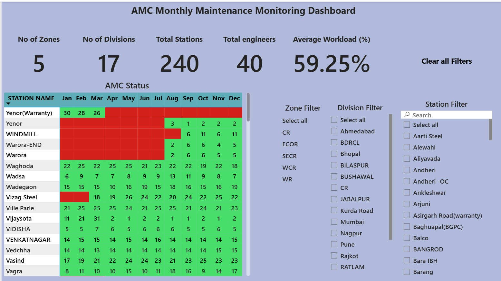

# 🏭 AMC Station Monitoring Dashboard (Power BI)

## 🔍 Quick Summary
Dashboard to monitor AMC station performance, engineer workload, and operational efficiency.

---

## 🛠 Tools Used
- Power BI  
- SQL  
- Excel  
- Data Modeling  

---

## 📈 Key Insights
- Station performance tracking  
- Engineer workload distribution  
- Failure handling and resolution time  
- Operational efficiency metrics  

---

## 🧩 Dataset Description

The project uses multiple datasets:

### Stations
- Station ID  
- Station Name  
- Location  

### Engineers
- Engineer ID  
- Name  
- Assigned Zone  

### Failures
- Failure Type  
- Reported Time  
- Resolved Time  
- Downtime  

---

## 📊 Dashboard Views

### Station Performance

- Station-wise performance  
- Failure counts  

---

### Engineer Analysis

- Workload distribution  
- Resolution efficiency  

---

### Failure Monitoring

- Downtime tracking  
- Failure trends  

---

## 🎯 Objective
To improve maintenance operations and track engineer performance effectively.

---

## 💼 Business Impact

- Improves maintenance efficiency  
- Tracks engineer productivity  
- Reduces downtime and operational delays  

---

🔗 Author: https://github.com/LTSGFH
